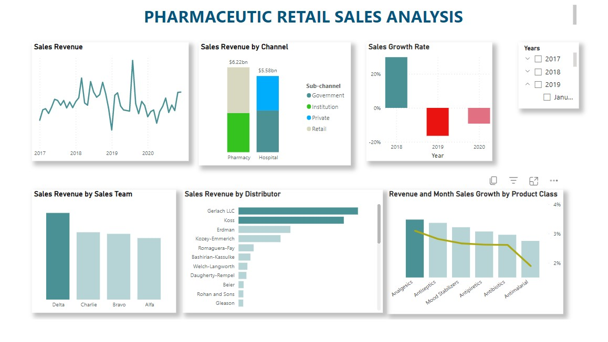

# Pharmaceutic Retail Sales Analysis
Foresight Pharmaceuticals is one of the leading Pharmaceutical Manufacturing companies with a global presence. Their Markets are divided into different regions across the world. One of those regions manages the Germany and Poland Markets. But the company does not sell directly to customers. Instead, they work with a couple of Distributors in all their regions.They have an agreement with each of the distributor to share their Sales Data with them. This is to enable them gain insights up to the retail level. [Here](https://docs.google.com/spreadsheets/d/1lFXl6RXFTLCn7IYOpzjDebhUt-4r_s6i/edit#gid=1600784802) is the sales data provided by distributors.

## Project Task
To execute sales analysis and generate insights at retail level

## Data transformation
Used a power query to transform data

Used custom column to create a date column but also changed data types of quantity, price and sales columns

## Data modelling
It was a simple modelling , created a calender table and connected it with a data table by date column

## Data analysis expression (DAX)
Created measures
* YOY growth % - year to year sales growth rate
* MOM sales growth % - month to month sales growth rate
* Total sales - sum of sales
* Calendar

## Dashboard

