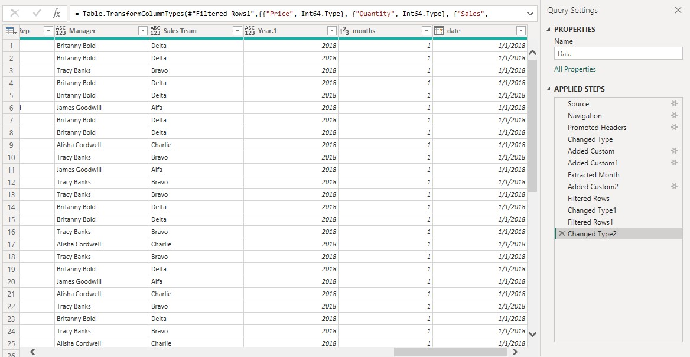
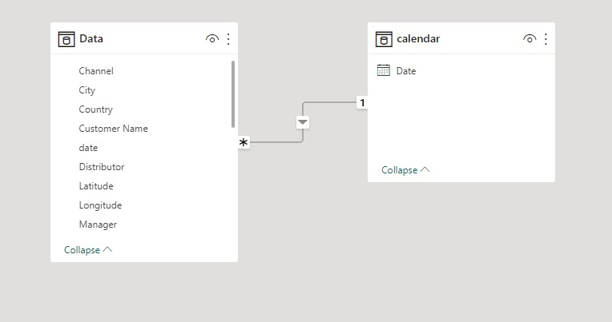
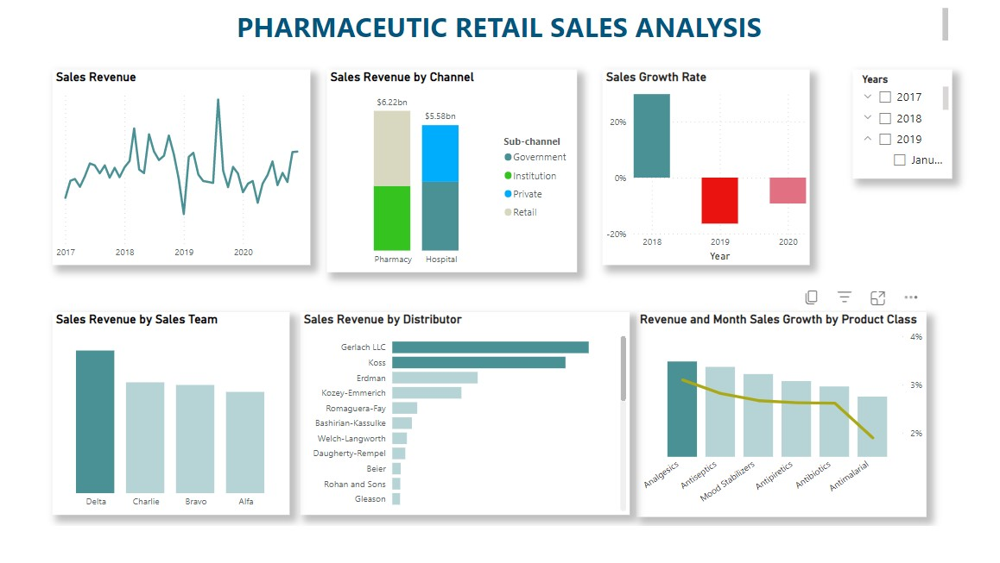

# Pharmaceutic Retail Sales Analysis
Foresight Pharmaceuticals is one of the leading Pharmaceutical Manufacturing companies with a global presence. Their Markets are divided into different regions across the world. One of those regions manages the Germany and Poland Markets. But the company does not sell directly to customers. Instead, they work with a couple of Distributors in all their regions.They have an agreement with each of the distributor to share their Sales Data with them. This is to enable them gain insights up to the retail level. [Here](https://docs.google.com/spreadsheets/d/1lFXl6RXFTLCn7IYOpzjDebhUt-4r_s6i/edit#gid=1600784802) is the sales data provided by distributors.

## Project Task
To execute sales analysis and generate insights at retail level

## Data transformation
Used a power query to transform data

Used custom column to create a date column but also changed data types of quantity, price and sales columns

## Data modelling
It was a simple modelling , created a calender table and connected it with a data table by date column

## Data analysis expression (DAX)
Created measures
* YOY growth % - year to year sales growth rate
* MOM sales growth % - month to month sales growth rate
* Total sales - sum of sales
* Calendar

## Report

You can interact with a live report [here](https://app.powerbi.com/view?r=eyJrIjoiYTJjMzZkMzktNjJjNi00OWI5LWFhNDEtNzU0MmI2ZGQyOThmIiwidCI6Ijc5M2EyYzE5LTY4N2ItNGJmOS05ZTBlLWJkOTU3YmE3ZDgxMyJ9)

## Insights
* Sum of sales dropped from $359,835,083 to $302,285,008 during its steepest decline between october 2018 and march 2019. The drop was contributed by koss distributor which its sum of sales changed by $40M from $59M.
* Change of product preference. The sum of sales of product class analgesics dropped while those of antiseptics and mood stabilizers rised
* The most recent anomaly was in august 2019, when sum of sales had a high value of $480,255,331.
* Year to year sales growth rate dropped from 29.81% to -9.26% during its steepest decline between 2018 and 2020
* Retail pharmacies and government hospitals have contributed more sales revenue across the years
* The delta sales team have more consistency in generating sales revenue
* Gerlach LLC and Koss distributors have more sum of sales compared to others.
* Analgesics, antiseptics and mood stabilizers product class have good sales performance across the years

## Recommendations
* The distributors and manufacturers should conduct market research to understand the reasons for the shift in consumer preferences. 
* The distributors should adapt the prefered product to meet the new demands of the market or consider introducing new product that align with the changing consumer preference
